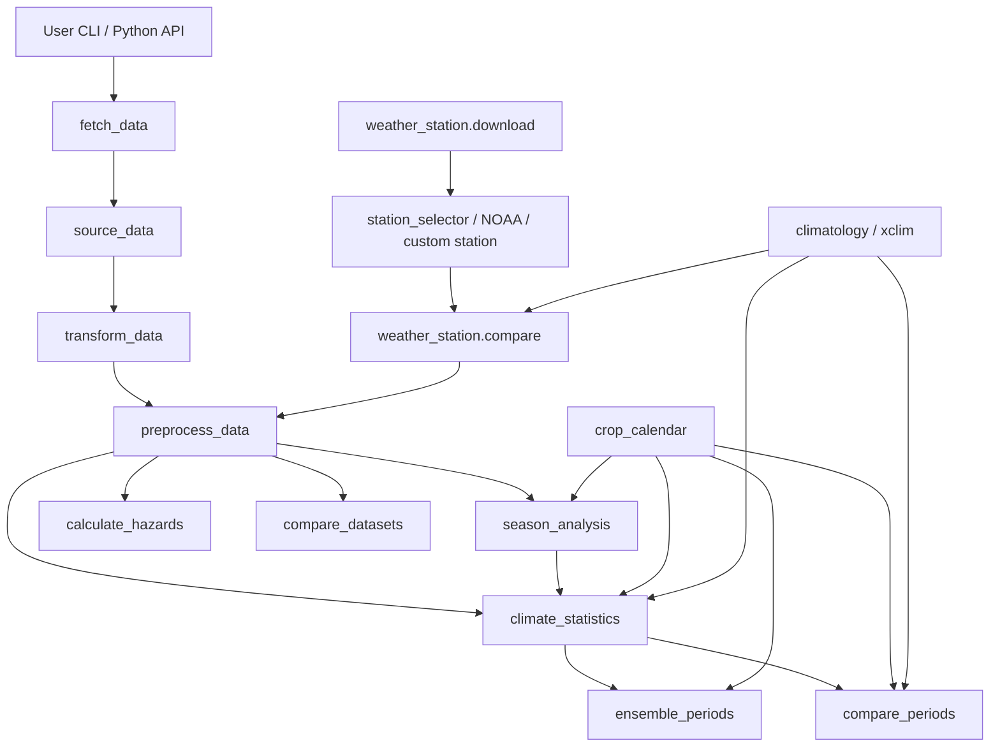

# Climate Data Toolkit

A unified toolkit for retrieving climate data from various global datasets such as CHIRPS, AGERA5, TerraClimate, IMERG, TAMSAT, CHIRTS, ERA5, NEX-GDDP, NASA POWER, CMIP6 and SoilGrids.

## API Dataset Badges

[](https://data.chc.ucsb.edu/products/CHIRPS-2.0/)
[](https://data.mcc.tu-berlin.de/agera5/)
[](http://www.climatologylab.org/terraclimate.html)
[](https://gpm.nasa.gov/data/imerg)
[](https://www.tamsat.org.uk/)
[](https://data.chc.ucsb.edu/products/CHIRTSdaily/)
[](https://cds.climate.copernicus.eu/cdsapp#!/dataset/reanalysis-era5-single-levels)
[](https://www.nccs.nasa.gov/services/data-collections/land-based-products/nex-gddp)
[](https://power.larc.nasa.gov/)
[](https://esgf-node.llnl.gov/projects/cmip6/)
[](https://www.isric.org/explore/soilgrids/)

---

## About

The Climate Toolkit offers a unified, programmatic interface to:

- Retrieve climate data from CHIRPS, AGERA5, TerraClimate, IMERG, TAMSAT, CHIRTS, ERA5, NEX-GDDP, NASA POWER, CMIP6 and SoilGrids
- Compute rainfall statistics, anomalies, and hazard indicators
- Compare climate trends over historical and seasonal periods

For user-facing historical daily climate work, the default module policy is
`chirps_v3_daily_rnl + agera_5`: CHIRPS v3 Daily RNL supplies precipitation and
AgERA5 supplies temperature plus companion variables such as humidity, wind,
and solar radiation. If a direct single-source historical fallback is needed,
prefer `agera_5`. Keep `era_5` available for compatibility, diagnostics, and
comparison work, but do not treat it as the primary recommended source.

TAMSAT remains available for completeness and Africa-focused precipitation
comparison work, but it is currently fragile and should not be treated as a
default or relied on for production workflows. It is precipitation-only, must
be paired with a temperature source for most analysis modules, and current
public access via JASMIN has shown slow performance and intermittent SSL /
download failures in live testing. Prefer `chirps_v3_daily_rnl + agera_5` for
normal user workflows.

---

## Quick Start

### Earth Engine setup

Most historical gridded defaults and all current NEX-GDDP real-access paths use
Earth Engine-backed retrieval. Do this first.

Important:

- `YOUR_PROJECT_ID` below is placeholder text
- replace it with your real Google Cloud **Project ID**
- do not paste literal string `YOUR_PROJECT_ID`

```bash
python -c "import ee; ee.Authenticate()"
export GCP_PROJECT_ID=YOUR_PROJECT_ID
python -c "import ee; ee.Initialize(project='$GCP_PROJECT_ID'); print('EE init OK')"
```

Windows PowerShell:

```powershell
python -c "import ee; ee.Authenticate()"
$env:GCP_PROJECT_ID="YOUR_PROJECT_ID"
python -c "import ee; ee.Initialize(project='$env:GCP_PROJECT_ID'); print('EE init OK')"
```

Required in `.env.example`:

- `GCP_PROJECT_ID`
- optional `EARTHDATA_USERNAME` / `EARTHDATA_PASSWORD` for sources that still
  use Earthdata-backed access

If you see:

- `Earth Engine project ID missing` -> set `GCP_PROJECT_ID`
- `Project 'projects/YOUR_PROJECT_ID' not found or deleted` -> placeholder was
  not replaced with real project ID
- auth refresh / DNS errors -> refresh Earth Engine auth and check internet/DNS

### Installation

1. Clone repository

   ```bash
   git clone https://github.com/CGIAR-Climate-Data-Hub/climate-toolkit.git
   cd climate-toolkit
   ```

2. Preferred setup with `uv`

   macOS / Linux:

   ```bash
   uv venv
   source .venv/bin/activate
   uv sync --locked --group dev
   ```

   Windows PowerShell:

   ```powershell
   uv venv
   .\.venv\Scripts\Activate.ps1
   uv sync --locked --group dev
   ```

   Repository commits `uv.lock`, so normal setup should stay on locked sync.
   After dependency edits, refresh lockfile with:

   ```bash
   uv lock
   ```

   Run commands through locked environment with:

   ```bash
   uv run climate-toolkit-stats --help
   uv run python -c "import climate_tookit; print('import ok')"
   uv run ruff check .
   uv run pytest -q
   ```

3. Fallback setup with `venv + pip`

   macOS / Linux:

   ```bash
   python -m venv .venv
   source .venv/bin/activate
   ```

   Windows PowerShell:

   ```powershell
   python -m venv .venv
   .\.venv\Scripts\Activate.ps1
   ```

   If PowerShell blocks activation:

   ```powershell
   Set-ExecutionPolicy -Scope Process -ExecutionPolicy Bypass
   .\.venv\Scripts\Activate.ps1
   ```

4. Install package with `pip` fallback

   Standard editable install:

   ```bash
   python -m pip install --upgrade pip
   python -m pip install -e .
   ```

   Standard non-editable install:

   ```bash
   python -m pip install .
   ```

   Fallback if you want raw dependency install only:

   ```bash
   python -m pip install -r requirements.txt
   ```

5. Copy environment template

   ```bash
   cp .env.example .env
   ```

### Distribution smoke path

Local build / install verification:

```bash
rm -rf .tmp/dist-release
uv run python -m build --no-isolation --outdir .tmp/dist-release
uv run twine check .tmp/dist-release/*
python -m pip install .tmp/dist-release/climate_tookit-*.whl
```

If you only want artifact verification without mutating current environment,
rely on automated smoke tests and CI build checks.

### Release strategy

Current decision:

- GitHub releases only for now
- no direct PyPI publish yet
- TestPyPI can come later once auth-heavy runtime expectations, install docs,
  and wheel smoke behavior stay stable across contributor machines

Reference note:

- `docs/distribution_workflow.md`

### Recommended starting point

For historical daily climate workflows, start with:

- precipitation: `chirps_v3_daily_rnl`
- temperature + companion variables: `agera_5`

For most higher-level modules, `--source auto` or `--source paired` will route
to this historical default behavior.

Do not mix historical sources with `nex_gddp` in one run. NEX-GDDP future /
baseline workflows should be run separately from observed/reanalysis workflows.

### First example

```bash
climate-toolkit-fetch \
  --source chirps_v3_daily_rnl \
  --lat -1.286 \
  --lon 36.817 \
  --start 2020-01-01 \
  --end 2020-01-10 \
  --variables precipitation \
  --stage preprocessed
```

Fallback module form:

```bash
python -m climate_tookit.fetch_data.fetch_data \
  --source chirps_v3_daily_rnl \
  --lat -1.286 \
  --lon 36.817 \
  --start 2020-01-01 \
  --end 2020-01-10 \
  --variables precipitation \
  --stage preprocessed
```

---

## Common Workflows

### Fetch climate data

Main entry point:

- `climate-toolkit-fetch`

Key options:

- `--source`: exact source key such as `chirps_v3_daily_rnl`, `chirps_v2`,
  `agera_5`, `era_5`, `nex_gddp`, `nasa_power`
- `--stage`: `raw`, `transformed`, `preprocessed`
- `--variables`: comma-separated toolkit variable names
- `--output`: optional output file
- `--format`: `print`, `csv`, `json`
- `--site` / `--sites-csv`: many-site fetch path for GEE/Xee-backed sources
- `--cache-dir`: stable local cache root for repeat reuse

NEX-GDDP requires:

- `--model`
- `--scenario`
- prior Earth Engine authentication
- `GCP_PROJECT_ID`

Current package runtime uses Earth Engine NEX-GDDP version `1.1`, not `1.2`.

NEX-GDDP humidity note:

- toolkit now supports relative humidity from Earth Engine band `hurs`
- this enables future-path livestock THI where `hurs` is available
- `hurs` is not universal across full Earth Engine NEX-GDDP catalog, so some
  model / scenario / year combinations still fail by design with clear error
- toolkit default 18-model curated pool avoids several catalog-documented
  humidity-gap models, so standard toolkit runs are safer than unrestricted
  full-catalog model selection

Livestock THI source support:

| Source | Status | Notes |
| --- | --- | --- |
| `agera_5` | supported | humidity derived from dewpoint + air temperature in current fetch pipeline |
| `nasa_power` | supported | humidity available from current NASA POWER fetch path |
| `ghcn_daily` | supported when available | uses station humidity when `RHAV` exists for chosen station and window |
| `gsod` | supported when available | uses station humidity when humidity field exists for chosen station and window |
| `custom_station` | supported when available | uploaded file must include humidity / RH column |
| `nex_gddp` | conditionally supported | uses Earth Engine `hurs`; some model / scenario / year combinations lack that band |
| `era_5` | uncertain | current toolkit ERA5 fetch configuration does not define a humidity band for operational THI use |
| `chirps_v2` | not supported | precipitation-only source |
| `chirps_v3_daily_rnl` | not supported | precipitation-only source |
| `imerg` | not supported | precipitation-only source |
| `tamsat` | not supported | no humidity data |
| `chirts` | not supported | temperature-only source |

Python users can inspect same support map directly:

```python
from climate_tookit.climatology import describe_thi_method, describe_thi_source_support

print(describe_thi_source_support())
print(describe_thi_method()["profiles"]["cattle_dairy"])
```

Dedicated method guide:

- [docs/thi_workflow.md](docs/thi_workflow.md)

Human heat first-pass note:

- toolkit now also exposes xclim-backed `humidex` helper functions for people
- this is still phase-1 support, but `calculate_hazards` now includes generic
  humidex screening classes and humidex day-count summaries when humidity-backed
  inputs exist
- `climate_statistics` and `compare_periods` now surface `humidex` when
  humidity or dewpoint-backed inputs exist
- in `paired` / composite historical workflows, human-heat provenance comes
  from temperature-side companion variables, not precipitation-side source
- `WBGT` and `UTCI` are intentionally deferred until wind/radiation support is
  more coherent across intended workflows

Python users can inspect current human-heat choice directly:

```python
from climate_tookit.climatology import (
    build_human_heat_source_bundle,
    compute_daily_humidex,
    describe_human_heat_method,
    describe_human_heat_source_support,
)

print(describe_human_heat_method()["metric"])
print(describe_human_heat_source_support())
print(build_human_heat_source_bundle(source="paired", precip_source="chirps_v3_daily_rnl", temp_source="agera_5"))
```

Dedicated method guide:

- [docs/human_heat_workflow.md](docs/human_heat_workflow.md)

Example:

```bash
env GCP_PROJECT_ID=YOUR_PROJECT_ID climate-toolkit-fetch \
  --source nex_gddp \
  --lat -1.286 \
  --lon 36.817 \
  --start 2050-01-01 \
  --end 2050-01-05 \
  --model MRI-ESM2-0 \
  --scenario ssp245 \
  --variables precipitation,max_temperature,min_temperature,humidity \
  --stage raw
```

### Season analysis

- `climate-toolkit-seasons`
- `climate-toolkit-seasons-ensemble`

Fixed-season example:

```bash
climate-toolkit-seasons \
  --location="-1.286,36.817" \
  --start-year=2020 \
  --end-year=2020 \
  --source=paired \
  --precip-source=chirps_v3_daily_rnl \
  --temp-source=agera_5 \
  --fixed-season="03-01:05-31"
```

### Climate statistics

- `climate-toolkit-stats`
- `climate-toolkit-stats-ensemble`

```bash
climate-toolkit-stats \
  --location="-1.286,36.817" \
  --start-year=2020 \
  --end-year=2020 \
  --source=paired \
  --precip-source=chirps_v3_daily_rnl \
  --temp-source=agera_5 \
  --fixed-season="03-01:05-31"
```

### Compare periods

- `climate-toolkit-periods`
- `climate-toolkit-periods-ensemble`

NEX-GDDP baseline-vs-future example:

```bash
climate-toolkit-periods-ensemble \
  --location="-1.286,36.817" \
  --baseline-start=1995 \
  --baseline-end=2013 \
  --future-start=2041 \
  --future-end=2060 \
  --scenarios=ssp245 \
  --fixed-season="03-01:05-31" \
  --livestock-type cattle_dairy
```

### Ensemble worker tuning

All NEX-GDDP ensemble CLIs now accept:

- `--model-workers`: bounded model-level parallelism for ensemble jobs

This currently applies to:

- `climate-toolkit-periods-ensemble`
- `climate-toolkit-stats-ensemble`
- `climate-toolkit-seasons-ensemble`
- `climate-toolkit-hazards-ensemble`
- `climate-toolkit-climatology` when `--source nex_gddp`

Practical guidance:

- `--model-workers 1`: serial debugging or very constrained environments
- `--model-workers 8`: default balanced setting
- `--model-workers 12`: heavier workstation run
- `--model-workers 16`: aggressive upper-end setting to test carefully

In restricted environments, the toolkit may fall back to serial execution if
process workers are blocked. When that happens, the CLI prints a warning and
continues rather than failing the entire run.

JSON outputs from ensemble workflows now include timing metadata under
`metadata.timing`, including worker request/usage fields and aggregate timing
such as `total_seconds` and `mean_model_seconds`.

### Hazards

- `climate-toolkit-hazards`
- `climate-toolkit-hazards-ensemble`

### Weather stations

- `climate-toolkit-weather-station-download`
- `climate-toolkit-weather-station-compare`

Candidate station review:

```bash
climate-toolkit-weather-station-download \
  --station-source auto \
  --selection-mode list \
  --station-lat -1.286 \
  --station-lon 36.817 \
  --start 2011-01-01 \
  --end 2020-12-31 \
  --variables precipitation,max_temperature,min_temperature \
  --max-distance-km 100 \
  --report-prefix outputs/weather_station/nairobi_auto_candidates
```

Station-vs-grid comparison:

```bash
climate-toolkit-weather-station-compare \
  --station-source auto \
  --station-lat -1.286 \
  --station-lon 36.817 \
  --target-elevation-m 1667 \
  --start 2011-01-01 \
  --end 2020-12-31 \
  --selection-mode auto \
  --auto-select auto-1 \
  --grid-source paired \
  --grid-source nasa_power \
  --precip-source chirps_v3_daily_rnl \
  --temp-source agera_5 \
  --variables precipitation,max_temperature,min_temperature \
  --output outputs/weather_station/nairobi_station_vs_grid.json
```

Custom station files are also supported in weather-station and selected
historical-analysis workflows. Current custom station flags include:

- `--custom-station-file`
- `--custom-station-vars`
- `--custom-temp-unit`
- `--custom-precip-unit`

### Python API

Top-level stable Python API names:

- `from climate_tookit import fetch_climate_data`
- `from climate_tookit import analyze_climate_statistics`
- `from climate_tookit import compare_climate_periods`
- `from climate_tookit import compare_climate_sources`
- `from climate_tookit import evaluate_hazards`
- `from climate_tookit import download_station_data`
- `from climate_tookit import compare_station_to_grids`

Notebook-safe example:

```python
from datetime import date

from climate_tookit import fetch_climate_data
from climate_tookit.fetch_data.source_data.sources.utils.models import ClimateVariable

df = fetch_climate_data(
    source="chirps_v3_daily_rnl",
    location_coord=(-1.286, 36.817),
    variables=[ClimateVariable.precipitation],
    date_from=date(2020, 1, 1),
    date_to=date(2020, 1, 10),
    stage="preprocessed",
)
```

In Jupyter, prefix shell commands with `!`:

```bash
!python -m climate_tookit.fetch_data.fetch_data --help
```

### Climatology

`climate-toolkit-climatology` writes annual and monthly climatology PNGs by
default under `./outputs`. Those plots now rely on the standard package
dependency set, including `matplotlib`.

NASA POWER example:

```bash
climate-toolkit-climatology \
  --location="-1.286,36.817" \
  --start-year=1991 \
  --end-year=2020 \
  --source=nasa_power
```

Earth Engine-backed historical example:

```bash
export GCP_PROJECT_ID=YOUR_PROJECT_ID
climate-toolkit-climatology \
  --location="-1.286,36.817" \
  --start-year=1991 \
  --end-year=2020 \
  --source=agera_5
```

Important source notes:

- `agera_5`, `era_5`, `chirps_v2`, `chirps_v3_daily_rnl`, `chirts`, `imerg`,
  and similar historical gridded sources are Earth Engine-backed in this
  toolkit. They need Earth Engine auth plus `GCP_PROJECT_ID`.
- `era_5` daily coverage currently ends on `2020-07-09` in this package. Use
  `agera_5` for a full `1991-2020` climatology window, or stop ERA5 at `2019`.
- `chirps_v2` / `chirps_v3_daily_rnl` are precipitation-only, so climatology
  will omit temperature outputs.
- `chirts` is temperature-only, so climatology will omit precipitation outputs.

SPEI and xclim helpers are library functions, not standalone console scripts.
Use them from Python after fetching/preprocessing climate data. VPD helpers use
`xclim` for thermodynamic calculation and prefer CHC-consistent
moisture-informed inputs (`relative_humidity` or `dewpoint`) when available:

```python
from climate_tookit.climatology.spei import (
    compute_monthly_spei,
    prepare_monthly_climatic_water_balance,
)
from climate_tookit.climatology import summarize_vpd_period
from climate_tookit.climatology.xclim_reference import (
    compute_xclim_precip_indices,
)

monthly_balance = prepare_monthly_climatic_water_balance(df, lat=-1.286)
spei_12 = compute_monthly_spei(monthly_balance, scale=12)
xclim_precip = compute_xclim_precip_indices(df)
vpd = summarize_vpd_period(df)
```

---

## Stable vs Internal Entry Points

Supported end-user CLI contracts:

- `climate-toolkit-fetch`
- `climate-toolkit-seasons`
- `climate-toolkit-seasons-ensemble`
- `climate-toolkit-stats`
- `climate-toolkit-stats-ensemble`
- `climate-toolkit-periods`
- `climate-toolkit-periods-ensemble`
- `climate-toolkit-hazards`
- `climate-toolkit-hazards-ensemble`
- `climate-toolkit-weather-station-download`
- `climate-toolkit-weather-station-compare`
- `climate-toolkit-compare-datasets`
- `climate-toolkit-climatology`

CLI implementation note:

- `climate-toolkit-climatology` is the current Typer prototype from issue `#34`
- the remaining public CLI entry points still use their existing `argparse`
  wrappers while compatibility and migration cost are evaluated
- current decision from issue `#34`: no broad CLI rewrite yet; any future Typer
  migration should be command-by-command, keep existing console-script names,
  and preserve `main()` entry points

Preferred stable import paths:

- top-level package for end-user workflows:
  - `climate_tookit.fetch_climate_data`
  - `climate_tookit.analyze_climate_statistics`
  - `climate_tookit.compare_climate_periods`
  - `climate_tookit.compare_climate_sources`
  - `climate_tookit.evaluate_hazards`
  - `climate_tookit.download_station_data`
  - `climate_tookit.compare_station_to_grids`
- explicit subpackage roots for supported advanced use:
  - `climate_tookit.fetch_data`
  - `climate_tookit.weather_station`
  - `climate_tookit.crop_calendar`
  - `climate_tookit.climatology`

Avoid depending on deep internal modules unless you are doing package
development. Examples of internal paths that are importable but not stable
contracts:

- `climate_tookit.fetch_data.source_data.source_data`
- `climate_tookit.fetch_data.preprocess_data.preprocess_data`
- `climate_tookit.fetch_data.transform_data.transform_data`
- `climate_tookit.fetch_data.gee_xee_batch`
- `climate_tookit.fetch_data.nex_gddp_batch`
- `climate_tookit.fetch_data.cache_inventory`
- `climate_tookit.fetch_data.source_data.sources.utils`

### Cache and reuse

GEE/Xee-backed fetches can be slow on a cold run because the toolkit has to
retrieve and standardize the source data before writing cache files. Once the
cache exists, repeat runs can be near-instant for the same source, site, date
window, and variable set.

For example, a live three-site, one-year benchmark on June 13, 2026 using:

- `chirps_v3_daily_rnl` cold cache: about 22 seconds
- `agera_5` with precipitation, temperature, humidity, wind, and solar cold cache: about 78 seconds
- either source from warm cache: about 0.75 seconds

If you want cache reuse across sessions, pass a stable project-local
`--cache-dir` such as `outputs/cache/...`.

### Cold cache vs warm cache

First run may take tens of seconds to minutes for GEE/Xee-backed workflows.
Repeat runs using same cache can be near-instant.

Observed live examples:

- `chirps_v3_daily_rnl`, 3 sites, 1 year, cold cache: about `22s`
- `agera_5`, 3 sites, 1 year, cold cache with companion variables: about `78s`
- warm-cache rerun for same requests: about `0.75s`

For project work, prefer stable cache roots under `outputs/cache/...`.

### NEX-GDDP regional screening pools

CLI/API name remains `regional_fast`, but this means regional screening subset,
not guaranteed fast runtime.

Decision memos:

- [East Africa](analysis/nex_regional_fast_pool_memo_eaf.md)
- [West Africa](analysis/nex_regional_fast_pool_memo_waf.md)
- [Andes](analysis/nex_regional_fast_pool_memo_andes.md)

### Ensemble runtime expectations

NEX-GDDP ensemble runs are still expensive even after model-worker parallelism.
The practical speedup is bounded by:

- Earth Engine / Xee request latency
- download chunk size
- number of models and scenarios
- per-model daily time-window length
- local process and memory limits

Use regional screening pools when you want a smaller candidate set for first
pass analysis, and expand to larger model pools only when the question requires
it.

### TAMSAT note

Use `tamsat` only as optional precipitation partner, not primary recommended
historical source.

- pair it with temperature source such as `agera_5`
- expect slower runs and possible download instability
- use as comparison / sensitivity source, not dependable default

---

## Project Structure

```
climate_tookit/
├── calculate_hazards/       # Hazard and risk workflows
├── climate_statistics/      # Seasonal / climatological stats
├── compare_periods/         # Baseline vs focal/future comparisons
├── fetch_data/              # Climate data retrieval and harmonization
├── season_analysis/         # Onset / cessation and season summaries
└── weather_station/         # Station download, selection, comparison
```

---

## Development

### Setting Up

- All configuration values (e.g., API keys) are managed via `.env` using `python-dotenv`.
- Modular dataset handlers are found in `climate_tookit/fetch_data/source_data/sources/`, each with `DownloadData` classes.
- Common utilities like enums and settings are stored in `climate_tookit/fetch_data/source_data/sources/utils/`.
- Current package architecture summary: `analysis/package_architecture_summary.md`
- NEX-GDDP real-access R&D note: `analysis/nex_gddp_access_rnd.md`
- `nex_gddp` now uses real Earth Engine/Xee retrieval. It requires Earth Engine auth plus `GCP_PROJECT_ID`.
- Current `nex_gddp` Earth Engine backend uses dataset version `1.1`. Future `1.2` sourcing is tracked as follow-up work, not current runtime behavior.
- `nex_gddp` humidity now uses Earth Engine `hurs` when available; toolkit raises explicit errors for documented missing-band cases instead of opaque fetch failures.
- Arid-region NEX rainfall-spike warning rationale and literature links are documented in `analysis/nex_gddp_access_rnd.md`.
- package install shape is tested through `pyproject.toml`, `uv.lock`, and console-script entrypoints
- preferred development install is `uv sync --locked --group dev`
- fallback editable install remains `python -m pip install -e .`
- non-editable smoke install path is `python -m pip install .`


### Solution Architecture

Current source-of-truth:

- `analysis/package_architecture_summary.md`

This README section is short operational summary. Detailed architecture,
boundary, and maintenance rules live in file above.

Current architectural principles:

- `fetch_data` is central ingest and harmonization layer
- historical and future-projection workflows share as much interface as possible, but do not require identical backends
- cache reuse under `outputs/cache/...` is part of runtime design, not incidental implementation detail
- stable user contracts are top-level Python API names plus CLI entry points from `pyproject.toml`
- deep internal modules remain non-stable development surface

Architecture flow diagram source:

- `assets/package_architecture_overview.mmd`



### Application Modules

Core current-state modules:

| Module | Role | Key dependencies |
|---|---|---|
| `fetch_data` | source dispatch, harmonization, stage handling, cache routing | `source_data`, `transform_data`, `preprocess_data`, GEE/Xee helpers |
| `season_analysis` | ET0, water balance prep, auto/fixed season detection | fetched daily climate series |
| `climate_statistics` | raw/overall/season/LTM/SPEI reductions | `fetch_data`, `season_analysis`, `climatology`, `crop_calendar` |
| `compare_periods` | baseline vs focal/future comparisons | `climate_statistics` payload contracts |
| `calculate_hazards` | hazard indicators and crop/soil-water metrics | fetched/preprocessed climate series, hazard params |
| `compare_datasets` | source-vs-source comparison workflow | shared fetch pipeline |
| `weather_station` | station discovery, ingestion, selection, station-vs-grid validation | NOAA/custom station inputs, gridded fetch layer |
| `crop_calendar` | GGCMI crop calendar lookups and presets | `season_analysis`, `climate_statistics`, `compare_periods` |
| `climatology` | SPEI and xclim-backed climatology helpers, including CHC-aligned moisture-informed VPD support | `climate_statistics`, `compare_periods`, `weather_station` |

Notes:

- `fetch_data` is central shared ingest layer for most package
- `season_analysis` feeds `climate_statistics`
- `climate_statistics` defines payload shape consumed by `compare_periods`
- weather-station workflows run parallel to gridded path, but compare against same gridded sources and can override some historical variables
- source/backend reality still differs by dataset; see `analysis/source_access_matrix.md`

### API Statuses & Response Format

These are the API statuses that will be applicable to this application.

<!-- Styled Table -->
<table style="width: 100%; border-collapse: collapse; margin-top: 1rem;">
  <thead style="background-color: rgb(31, 28, 28);">
    <tr>
      <th style="padding: 8px; border: 1px solid #666;">Status Code</th>
      <th style="padding: 8px; border: 1px solid #666;">Status</th>
      <th style="padding: 8px; border: 1px solid #666;">Message</th>
    </tr>
  </thead>
  <tbody>
    <tr>
      <td style="padding: 8px; border: 1px solid #ccc;">20X</td>
      <td style="padding: 8px; border: 1px solid #ccc;">REQUEST_SUCCESSFUL</td>
      <td style="padding: 8px; border: 1px solid #ccc;">"Your request was received and data processed successfully"</td>
    </tr>
    <tr>
      <td style="padding: 8px; border: 1px solid #ccc;">40X</td>
      <td style="padding: 8px; border: 1px solid #ccc;">REQUEST_UNSUCCESSFUL</td>
      <td style="padding: 8px; border: 1px solid #ccc;">"Your request was received but there was an issue with processing the data"</td>
    </tr>
    <tr>
      <td style="padding: 8px; border: 1px solid #ccc;">50X</td>
      <td style="padding: 8px; border: 1px solid #ccc;">SERVICE_UNREACHABLE</td>
      <td style="padding: 8px; border: 1px solid #ccc;">"Your request was not received by the server"</td>
    </tr>
  </tbody>
</table>

<!-- Text content -->

<div style="display: flex; align-items: flex-start; gap: 32px; margin-top: 1.5rem; flex-wrap: wrap;">
  <!-- Left column -->
  <div style="flex: 1; min-width: 280px;">
    <p>
      This is a basic structure of the API response format containing the mandatory fields. This enables the responses for various services consumed in this toolkit to have a standardised response format. It should be noted that the payload key-value pairs will depend on the return values of the application logic:
    </p>
    <ul style="padding-left: 1.25rem; line-height: 1.6;">
      <li><code>status_code</code>: integer</li>
      <li><code>status</code>: string</li>
      <li><code>message</code>: string</li>
      <li><code>data</code>: json</li>
    </ul>
  </div>
  <!-- Right column -->
  <div style="flex: 1; min-width: 280px; padding: 16px; border: 1px dashed #ccc; font-family: monospace; font-size: 0.9em;">
    <pre style="margin: 0;">{
  "status_code": 200,
  "status": "REQUEST_SUCCESSFUL",
  "message": "Your request was received and data processed successfully",
  "data": {
    # Payload depends on the app logic's return values
    "key1": "value1",
    "key2": "value2"
  }
}</pre>
  </div>
</div>

# Development Best Practices

| # | Practice | Description |
|---|----------|-------------|
| 1 | Commit Early and Often | Don't wait until a large feature is complete. Commit small, logical, and self-contained changes. |
| 2 | Atomic Commits | Each commit should represent a single, coherent change or a small set of related changes. If you're fixing two different bugs, create two separate commits. |
| 3 | Don't Commit Half-Done Work (to shared branches) | While local commits can be frequent, avoid pushing incomplete or broken code to shared development branches. Use "git stash" if you need a clean working directory temporarily. |
| 4 | Test Before Committing | Ensure your code works as expected and passes tests before committing. |
| 5 | Review Before Committing | Use "git diff" to review your own changes before committing to catch unintended modifications. |
| 6 | Conventional Commits | Consider adopting a convention like Conventional Commits (feat:, fix:, chore:, docs:, ci:, refactor:, test:) to categorize changes and enable automated changelog generation. For example, "feat: Add CHIRPS as a climate data source". Ref: https://www.conventionalcommits.org |
| 7 | Consistent Naming Conventions | Establish clear and consistent naming conventions for branches (e.g., feat/feature-name, fix/issue-description, refactor/performance-improvement, etc). |
| 8 | Pull Regularly | Each feature or fix should be developed on a dedicated branch. These branches should be short-lived and merged back into a main development branch (e.g., develop or main) as soon as the work is complete and reviewed. Pull frequently to avoid merge conflicts. |
| 9 | Branching Strategies | GitLab Flow will be used. It will have the following branches:<br><br>a. main: This branch should always be stable and deployable. Direct commits to this branch should be prohibited; all changes must come through pull requests.<br><br>b. staging: This branch is for the UAT/QA environment. Direct commits to this branch should be prohibited; all changes must come through pull requests. Maintainers can have "force push" access. |
| 10 | Well-Documented Pull Requests (PRs) | Summarize the PR's purpose effectively in the subject. The PR should also have a detailed description that covers:<br><br>a. Problem Statement: Clearly describe the problem or feature addressed by the PR.<br><br>b. Solution Overview: Explain how the PR solves the problem or implements the feature.<br><br>c. Technical Details (if necessary): Provide any necessary technical context, architectural decisions, or trade-offs.<br><br>d. Screenshots/Videos: For UI changes, include screenshots or short videos to demonstrate the changes.<br><br>e. Testing Instructions: Provide clear steps for reviewers to test the changes, including any specific configurations or data needed.<br><br>f. Related Issues/Tickets: Link to relevant issues in your issue tracker. |
| 11 | DevOps | Automating the build, test, and deployment process ensures that code changes are integrated frequently and validated quickly. This catches issues early and provides rapid feedback. This will be implemented using GitHub Actions since it is native to GitHub. |
| 12 | Conversation Trails | Keep implementation discussions on the ticket in the Kanban system. This makes it easier to maintain a trail of the conversations and decisions regarding a proposed feature or fix. If discussions are held outside of the ticket (e.g., on Teams due to confidentiality), the conclusions from those discussions should be transferred to the ticket itself. This will still allow the project to maintain an trail of the conversation and decisions affecting the implementation of the feature. |
---

## Contributing

We welcome PRs and suggestions!

1. Fork the repo
2. Work in a feature branch
3. Follow module layout and Ruff checks
4. Submit a pull request with a clear description using the repository PR template
5. Complete every applicable PR template section, especially problem statement, implementation notes, data/auth/runtime notes, testing, and related issues

Local quality commands:

```bash
uv sync --locked --group dev
rm -rf .tmp/dist-release
uv run python -m build --no-isolation --outdir .tmp/dist-release
uv run twine check .tmp/dist-release/*
uv run ruff check .
uv run ruff format .
uv run pytest -q
```

CI currently enforces the low-noise Ruff lint baseline with `ruff check .`.
`ruff format` is available for local cleanup, but repository-wide formatter
enforcement should come in a later cleanup slice rather than the initial Ruff
adoption PR.

---

## Weather Station Workflows

Toolkit supports:

1. NOAA station discovery and download with `ghcn_daily`, `gsod`, or `auto`
2. station-vs-grid comparison against historical gridded products
3. custom station CSV/JSON ingestion
4. custom station override into historical climate analysis

Detailed guide:

- [docs/weather_station_workflows.md](docs/weather_station_workflows.md)

Before first run:

- `--station-lat` / `--station-lon` are focal site coordinates, not necessarily final chosen station coordinates
- start with `--selection-mode list` if you do not already know station quality nearby
- evaluate completeness by variable before asking for full precip + Tmax + Tmin bundle
- if DEM-based elevation guard matters, either provide `--target-elevation-m` or make sure Earth Engine auth and `GCP_PROJECT_ID` are valid

### Core concepts

- `--station-source`
  - `ghcn_daily`: NOAA GHCN-Daily only
  - `gsod`: NOAA GSOD only
  - `auto`: rank candidates across both NOAA backends
  - `custom_csv`: user-supplied CSV/JSON
- `--selection-mode`
  - `list`: inspect candidates only; no station data download
  - `specified`: use `--station-id`
  - `auto`: toolkit chooses station(s) inside current guardrails
- `--auto-select`
  - `auto-1`, `auto-2`, `auto-3`, ...
  - `auto-all`: use as many eligible stations as current `--max-auto-stations` cap allows
- compare workflow also has `--selection-strategy`
  - `all_vars_single_station`: one station must carry all requested variables
  - `best_per_variable`: toolkit may use different nearby stations for precipitation vs temperature

Default guardrails:

- search radius: `50 km`
- maximum elevation difference: `500 m`
- minimum per-variable completeness: `0.70`
- maximum auto-selected stations: `10`

Completeness relaxation:

- strict threshold first: requested `--min-completeness-ratio`
- relaxed sequence after that: `0.50 -> 0.30 -> 0.10`
- if still no station passes and fallback allowed, toolkit may keep stations that satisfy only some requested variables

This means station selection is variable-by-variable, not only one overall coverage score.

### Candidate Review

Find nearby observed stations and create review artifacts:

```bash
climate-toolkit-weather-station-download \
  --station-source auto \
  --selection-mode list \
  --station-lat -1.286 \
  --station-lon 36.817 \
  --start 2011-01-01 \
  --end 2020-12-31 \
  --variables precipitation,max_temperature,min_temperature \
  --max-distance-km 100 \
  --report-prefix outputs/weather_station/nairobi_auto_candidates \
  --open-report
```

Outputs:

- candidate CSV
- candidate JSON
- candidate HTML map

Candidate review is best first step when:

- you do not know which stations exist nearby
- you want to inspect completeness by variable before download
- you want map showing focal coordinates vs candidate station positions

Map notes:

- `--open-report` tries to open HTML map automatically
- map uses live web tiles, so background basemap needs internet
- report shows only stations discoverable through current toolkit NOAA backends

### NOAA Station Download

```bash
climate-toolkit-weather-station-download \
  --station-source auto \
  --selection-mode auto \
  --auto-select auto-1 \
  --station-lat -1.286 \
  --station-lon 36.817 \
  --start 2011-01-01 \
  --end 2020-12-31 \
  --variables precipitation,max_temperature,min_temperature \
  --stage preprocessed
```

Useful variants:

- pin one station with `--selection-mode specified --station-id <ID>`
- widen search with `--max-distance-km`
- supply known elevation with `--target-elevation-m`
- disable completeness guard for exploratory work with `--disable-completeness-guard`
- keep raw values with `--stage raw`

### Custom Station File

```bash
climate-toolkit-weather-station-download \
  --station-source custom_csv \
  --custom-station-file path/to/station.csv \
  --custom-station-name "My station" \
  --station-lat -1.286 \
  --station-lon 36.817 \
  --start 2020-01-01 \
  --end 2020-12-31 \
  --variables precipitation,max_temperature,min_temperature \
  --custom-temp-unit c \
  --custom-precip-unit mm
```

Expected custom file shape:

- required:
  - `date`
  - at least one requested climate variable
- accepted precipitation aliases:
  - `precipitation`, `precip`, `rain`, `rainfall`, `prcp`
- accepted temperature aliases:
  - `tmax` / `max_temperature`
  - `tmin` / `min_temperature`
  - `tmean` / `mean_temperature`
- optional metadata:
  - `station_id`, `station_name`, `lat`, `lon`, `elevation`

Declare units explicitly:

- `--custom-temp-unit c|f|k`
- `--custom-precip-unit mm|inch|tenth_mm`

Custom file notes:

- toolkit normalizes aliases, subsets requested period, converts units, then caches normalized outputs
- if `mean_temperature` missing but `max_temperature` and `min_temperature` exist, toolkit derives mean temperature
- if `station_id`, `station_name`, `lat`, `lon`, or `elevation` missing, toolkit fills best-effort metadata from CLI inputs and file name
- if uploaded file has no rows in requested window, historical override workflows fall back to gridded values with warning

### Station vs Grid Comparison

```bash
climate-toolkit-weather-station-compare \
  --station-source auto \
  --station-lat -1.286 \
  --station-lon 36.817 \
  --start 2011-01-01 \
  --end 2020-12-31 \
  --selection-mode auto \
  --auto-select auto-1 \
  --grid-source paired \
  --grid-source nasa_power \
  --precip-source chirps_v3_daily_rnl \
  --temp-source agera_5 \
  --variables precipitation,max_temperature,min_temperature \
  --output outputs/weather_station/nairobi_station_vs_grid_2011_2020.json
```

Comparison intent:

- compare observed station data against historical gridded products near same location
- assess which historical grid source best represents local observed conditions
- not direct future `nex_gddp` validation workflow

Current grid-source notes:

- better independence: `agera_5`, `era_5`, `nasa_power`, `imerg`
- partly station-informed: `chirps_v2`, `chirps_v3_daily_rnl`, `chirts`, `paired`, `terraclimate`, `auto`
- comparison output warns when selected grid source is not fully independent from station-based validation

Output layers include:

- daily metrics
- monthly aggregated metrics
- seasonal aggregated metrics
- annual overlap summary
- xclim-derived annual precipitation reference indices when overlap is dense enough
- pooled multi-station summaries when more than one station contributes

Interpretation caution:

- daily precipitation correlation often looks weak even when monthly or seasonal agreement is useful
- annual and xclim summaries should only be trusted when overlap coverage is dense enough
- `paired` is mixed-source workflow, so interpret independence using underlying precip and temperature products

### Historical Analysis With Custom Overrides

```bash
climate-toolkit-stats \
  --location="-1.286,36.817" \
  --start-year=2020 \
  --end-year=2020 \
  --source=paired \
  --precip-source=chirps_v3_daily_rnl \
  --temp-source=agera_5 \
  --custom-station-file path/to/station.csv \
  --custom-station-vars precipitation,max_temperature,min_temperature \
  --custom-station-name "My station"
```

Override workflow purpose:

- substitute observed station variables into historical season/statistics workflows
- keep gridded variables for anything not supplied by station file

Current override entry points:

- `climate-toolkit-stats`
- `climate-toolkit-seasons`

### Caching

Weather-station cache uses:

- `outputs/cache/weather_stations/ghcn_daily`
- `outputs/cache/weather_stations/gsod`
- `outputs/cache/weather_stations/custom`
- `outputs/cache/weather_stations/dem_anchor`

Typical contents:

- NOAA station metadata / inventories
- downloaded station files
- custom-station normalized CSV plus manifest JSON
- DEM-derived focal elevation lookups
- candidate review artifacts under chosen `--report-prefix`

Keep cache under project-local `outputs/cache/...` so repeat runs can reuse saved files.

If station selection fails:

- widen `--max-distance-km`
- request fewer variables
- lower `--min-completeness-ratio`
- inspect `--selection-mode list` output before disabling guards
- use `best_per_variable` only if mixed-station interpretation is acceptable

### Current limitations

- some locations have very sparse observed coverage, especially for full precip + tmax + tmin overlap
- `auto` only sees current NOAA backends plus user-supplied custom files; not all global station archives
- compare workflow is historical-grid only; future NEX-GDDP station evaluation remains separate methodological work
- candidate review map is HTML, not full GIS export
- mixed-station compare strategies can improve variable coverage, but reduce simplicity of interpretation
- Earth Engine-backed helper pieces such as anchor elevation need valid project/auth if DEM lookup is used automatically

## Metric Provenance

Not all toolkit metrics belong to same methodological family.

Standard / xclim-audited examples:

- precipitation total
- rainy days
- dry days
- `NDD` dry-day count semantics (`< 1 mm/day`)
- `NTx35` / `NTx40` hot-day count semantics
- daily precipitation intensity style metrics
- max 1-day precipitation
- max 5-day precipitation in weather-station reference comparisons
- core Tmax / Tmin / Tavg period summaries
- nearest-reference SPI / SPEI comparisons

Custom, non-xclim metrics:

- `NDWS`
- `NDWL0`
- `WRSI`
- crop-calendar-aware season windows
- crop-threshold hazard interpretation

Important distinction:

- some hazard *counts* are xclim-audited (`NDD`, `NTx35`, `NTx40`)
- hazard *bands / stress labels* built on those counts are still Atlas-inspired
  provisional interpretation, not xclim outputs

Reference note:

- [analysis/xclim_metric_audit_status.md](analysis/xclim_metric_audit_status.md)

---

## License

This project is licensed under the [MIT License](./LICENSE).
