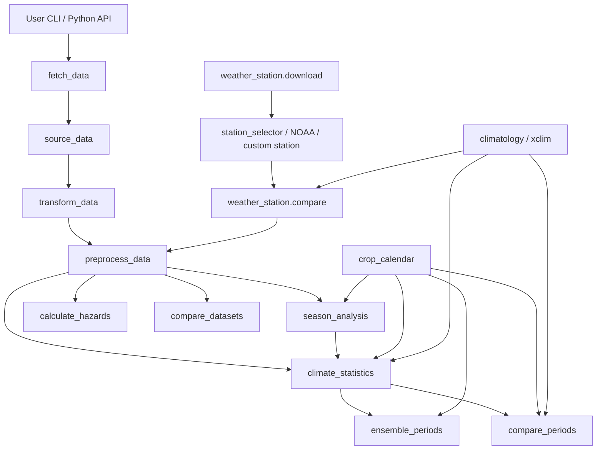

# Package Architecture Summary

Status: current working summary  
Updated: 2026-06-21

This file is intended to be current-state architecture reference for
developers, reviewers, and coding agents. It should describe actual runtime
behavior, not aspirational design.

## Purpose

`climate_tookit` is modular Python package for:

- fetching and harmonizing climate data
- detecting seasons and summarizing climate conditions
- comparing historical periods and future NEX-GDDP periods
- calculating hazard indicators
- evaluating nearby weather-station data against gridded products

Package supports both:

- stable end-user CLI entry points
- stable top-level Python API names

## Stable public surface

Top-level stable Python API:

- `climate_tookit.fetch_climate_data`
- `climate_tookit.analyze_climate_statistics`
- `climate_tookit.compare_climate_periods`
- `climate_tookit.compare_climate_sources`
- `climate_tookit.evaluate_hazards`
- `climate_tookit.download_station_data`
- `climate_tookit.compare_station_to_grids`

Stable CLI entry points from `pyproject.toml`:

- `climate-toolkit-fetch`
- `climate-toolkit-seasons`
- `climate-toolkit-seasons-ensemble`
- `climate-toolkit-stats`
- `climate-toolkit-stats-ensemble`
- `climate-toolkit-periods`
- `climate-toolkit-periods-ensemble`
- `climate-toolkit-hazards`
- `climate-toolkit-hazards-ensemble`
- `climate-toolkit-weather-station-download`
- `climate-toolkit-weather-station-compare`
- `climate-toolkit-compare-datasets`
- `climate-toolkit-climatology`

Internal modules below these surfaces are importable but not stable contract.

## Layer model

### 1. User entry layer

Human-facing entry points:

- top-level package exports in `climate_tookit/__init__.py`
- CLI modules with `main()` functions

This layer should remain thin. It should parse args, call library functions,
print/save output, and avoid owning core science logic.

### 2. Workflow orchestration layer

Main orchestration modules:

- `fetch_data/fetch_data.py`
- `season_analysis/seasons.py`
- `climate_statistics/statistics.py`
- `compare_periods/periods.py`
- `compare_periods/ensemble_periods.py`
- `calculate_hazards/hazards.py`
- `weather_station/download.py`
- `weather_station/compare.py`

These modules coordinate:

- source selection
- fetch windows
- cache usage
- seasonal or period reductions
- reporting and persistence

### 3. Data-source and transform layer

Fetch pipeline roots:

- `fetch_data/source_data/`
- `fetch_data/transform_data/`
- `fetch_data/preprocess_data/`

Key responsibilities:

- raw source access
- variable-name harmonization
- unit conversion
- stage transitions: raw -> transformed -> preprocessed

Important shared helpers:

- `fetch_data/gee_xee_batch.py`
- `fetch_data/nex_gddp_batch.py`
- `fetch_data/multi_site.py`
- `fetch_data/cache_inventory.py`
- `fetch_data/runtime_notes.py`

### 4. Shared analytical building blocks

- `season_analysis/season_identity.py`
- `crop_calendar/ggcmi.py`
- `crop_calendar/registry.py`
- `climatology/spei.py`
- `climatology/xclim_reference.py`
- `weather_station/overrides.py`

These modules support multiple higher-level workflows.

### 5. Resource and packaged-data layer

Static packaged resources:

- GGCMI crop calendar parquet/json under `climate_tookit/data/ggcmi_phase3/`
- variable dictionaries / YAML config files
- hazard parameter JSON

Resource loading should remain package-safe and install-safe.

## Core workflow graph

## Actual package coupling

### `fetch_data`

`fetch_data` is central shared ingestion path.

It handles:

- source dispatch
- single-site and multi-site fetch
- stage selection
- cache-directory routing
- Earth Engine/Xee batch routing for many historical sources
- NEX-GDDP-specific routing

This module is foundation layer for most package.

### `season_analysis`

`season_analysis.seasons` owns:

- ET0 derivation
- water-balance prep used by season logic
- auto onset/cessation detection
- fixed-season parsing
- year-level season outputs

Other modules reuse this logic rather than duplicating season detection.

### `climate_statistics`

`climate_statistics.statistics` builds on fetched climate data plus season
detection. It produces:

- raw climate summaries
- overall statistics
- season statistics
- LTM summaries
- optional SPEI blocks
- season detection review status

This module is main reducer used by `compare_periods`.

### `compare_periods`

Two main modes:

- historical or paired focal-vs-baseline comparison in `periods.py`
- NEX-GDDP baseline-LTM vs future-LTM ensemble comparison in
  `ensemble_periods.py`

This layer depends heavily on output shape from `climate_statistics`.

### `calculate_hazards`

Hazard calculations consume analysis-ready daily climate series, crop
parameters, and soil/water-balance assumptions.

Current implementation includes NDWS/WRSI-related work and hazard thresholds,
with ongoing alignment to Atlas / xclim follow-up tracked in issue docs.

### `weather_station`

Weather-station support is parallel track, not replacement for gridded path.

It provides:

- station discovery / selection
- GHCN-Daily and GSOD access
- custom station ingestion
- candidate-review outputs including map/html/json/csv
- station-vs-grid comparison against toolkit climate sources

Weather-station outputs can also override historical variables in some climate
analysis workflows.

## Data-source architecture reality

Important practical split:

- local-open sources
- Earth-Engine-authenticated sources
- fragile / optional sources

Current reality documented in more detail here:

- `analysis/source_access_matrix.md`

Most important runtime note:

- many historical gridded products route through shared Earth Engine/Xee path
- `nex_gddp` also uses Earth Engine/Xee
- `nasa_power` remains clean direct HTTP source
- `tamsat` exists but should be treated as fragile optional source

## Cache and persistence model

Main cache root:

- `outputs/cache/...`

Cache design now matters architecturally because many workflows expect warm
cache reuse across runs, not session-only transient data.

Major cache families:

- historical GEE/Xee chunk caches
- NEX-GDDP caches
- weather-station source caches
- inventory/manifest views for audit

When changing cache layout, update this file and user docs.

## Current design constraints

### Historical vs projection split

Package now effectively has two large execution families:

- historical / recent climate workflows
- future projection / NEX-GDDP workflows

They should stay harmonized where possible, but do not need identical backends.

### Comparison modules depend on payload shape

`compare_periods` and `ensemble_periods` assume fairly specific output schema
from `climate_statistics`. Any schema change here is architectural and should
be documented.

### Reporting still mixed with library logic in some modules

Refactor work improved package shape, but some large modules still mix:

- orchestration
- reduction logic
- report rendering
- CLI save behavior

This remains known technical-debt area.

## Where to read next

Use these docs together with this summary:

- source/backend reality:
  - `analysis/source_access_matrix.md`
- package-shape / import-contract history:
  - `analysis/issues/package_refactor_investigation.md`
- weather-station design:
  - `analysis/weather_station_module_design_2026-06-15.md`
- NEX runtime / access notes:
  - `analysis/nex_gddp_access_rnd.md`
- regional fast-pool decision memos:
  - `analysis/nex_regional_fast_pool_eaf.md`
  - `analysis/nex_regional_fast_pool_waf.md`
  - `analysis/nex_regional_fast_pool_andes.md`

## Maintenance rule

Update this file whenever any of these change:

- stable top-level Python API names
- CLI entry points
- module ownership boundaries
- major inter-module dependencies
- source routing model
- cache layout / persistence rules
- weather-station integration path
- compare-periods payload contracts

If change is local bugfix only, no update needed.

