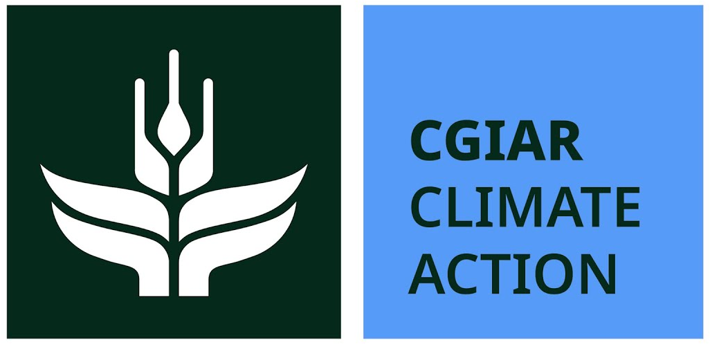

# About the Climate Toolkit

**From a point on the map to climate evidence you can stand behind.**

The Climate Toolkit is an open-source tool for anyone working in agroecology
and food systems who needs to know what the climate did — or will do — at the
places they work. Give it a location and it fetches trusted climate data,
works out the growing season, and measures the hazards that matter to crops,
livestock, and people.

It was built for a simple reason: the people who most need climate evidence
shouldn't have to become climate-data engineers to get it.

Funded by the [McKnight Foundation (CRFS programme)](https://www.mcknight.org/programs/global-foods/)
and the [CGIAR Climate Action Program](https://www.cgiar.org/cgiar-research-portfolio-2025-2030/climate-action/)
through AoW1 — the Climate Data Hub, in partnership with [AIMS Rwanda](https://aims.ac.rw/):

  
  
  

---

## The problem

Nearly every agroecology project claims to build climate resilience. Very few
can show it.

It's not for lack of data — the data exists, in abundance. But it is scattered
across dozens of archives, each with its own formats, credentials, and quirks.
Joining it to the farm and household records a project already holds takes
time, bandwidth, and coding skill that most research and M&E teams don't have
to spare. So the climate context stays anecdotal — *"it was a dry year"* —
instead of measured.

The result is a gap between the resilience we claim and the resilience we can
prove. That gap weakens reports, proposals, and ultimately the case for
agroecology itself.

## What the toolkit does

No new datasets, no new portal to maintain — one consistent doorway to the
open climate data that already exists, with the analysis steps built in.

-   :material-database-arrow-down-outline:{ .lg .middle } **Fetch**

    ---

    Daily climate data for any point location from CHIRPS, AgERA5, NASA
    POWER, TerraClimate, IMERG, CMIP6 projections, and nearby weather
    stations — returned as one tidy, analysis-ready table.

-   :material-sprout-outline:{ .lg .middle } **Understand the season**

    ---

    Seasonal climatologies, water balance, and drought indices (SPI/SPEI)
    over the years that matter to a place.

-   :material-alert-outline:{ .lg .middle } **Measure the hazards**

    ---

    Crop- and livestock-relevant risks — heat, drought, waterlogging —
    assessed across a growing season, with sensible thresholds you can
    customise.

-   :material-compare-horizontal:{ .lg .middle } **Compare and check**

    ---

    A hard year against the long-term normal, one dataset against another,
    or a gridded product against a real weather station.

Because it works from a single point and reuses trusted open data, it stays
light, low-cost, and usable where bandwidth is limited. You can run the whole
thing in your browser — no installation — via the
[companion Colab notebook](https://colab.research.google.com/github/CGIAR-Climate-Data-Hub/climate-toolkit/blob/main/examples/climate_toolkit_colab.ipynb).

## Who it's for

-   :material-clipboard-check-outline:{ .lg .middle } **Project & M&E teams**

    ---

    You hold data on farms, practices, and outcomes — but not the climate
    context to show whether an intervention helped people cope with a hard
    season. The toolkit adds that context and turns it into a defensible,
    quantified story for reports and proposals. No coding from scratch.

-   :material-flask-outline:{ .lg .middle } **Researchers**

    ---

    One reproducible interface to the datasets and hazard indicators you
    use, so you spend less time wrangling sources and more time on the
    science.

-   :material-account-group-outline:{ .lg .middle } **Data & support staff**

    ---

    The multipliers. Learn it once, embed it in your team's everyday
    workflow, and equip everyone around you.

-   :material-school-outline:{ .lg .middle } **Educators & students**

    ---

    A real, well-documented, open tool for teaching and learning climate
    data analysis.

If you work with a place and want to know what its climate has done, is
doing, or may do — this is for you.

## Where we're going

We want climate evidence to be a normal, everyday part of agroecological
research and practice — not a specialist luxury. Over the longer term that
means lowering the technical bar until any motivated team can add solid
climate context to their work; consolidating scattered climate-analysis
know-how into one open, trustworthy place people build on rather than
reinvent; and strengthening the evidence base for agroecology as a climate
solution — moving the field from *assumed* resilience to *measured*
resilience. The toolkit will grow with its users: more crops, more hazards,
more regions, more languages, always open, always a public good.

## Get involved

The toolkit is in active early development (alpha), and it is being shaped by
the people who use it. This is the best moment to influence where it goes.

-   :material-rocket-launch-outline:{ .lg .middle } **Try it**

    ---

    Open the [Colab notebook](https://colab.research.google.com/github/CGIAR-Climate-Data-Hub/climate-toolkit/blob/main/examples/climate_toolkit_colab.ipynb)
    and run it on a location you care about. No install, no setup.

-   :material-bug-outline:{ .lg .middle } **Tell us what's missing**

    ---

    A bug, a missing crop, a hazard we don't cover, something confusing?
    [Open an issue](https://github.com/CGIAR-Climate-Data-Hub/climate-toolkit/issues)
    — every one directly shapes the roadmap.

-   :material-forum-outline:{ .lg .middle } **Join the conversation**

    ---

    Questions, ideas, and show-and-tell live in
    [GitHub Discussions](https://github.com/CGIAR-Climate-Data-Hub/climate-toolkit/discussions)
    — the home of our growing community of practice.

-   :material-teach:{ .lg .middle } **Learn with us**

    ---

    A short, practical training course is in development — built around
    real datasets, including your own, for people who work with project
    data but aren't necessarily coders. Course materials will live here.

## Funding & acknowledgements

The Climate Toolkit was developed through the project *Advancing Climate Data
Integration in Agroecological Research*, funded by the
[McKnight Foundation](https://www.mcknight.org/) through its
[Global Collaboration for Resilient Food Systems (CRFS)](https://www.mcknight.org/programs/global-foods/)
programme. The work was led by the
[Alliance of Bioversity International and CIAT](https://alliancebioversityciat.org/),
in partnership with [AIMS Rwanda](https://aims.ac.rw/).

This work was supported by the
[CGIAR Climate Action Program](https://www.cgiar.org/cgiar-research-portfolio-2025-2030/climate-action/)
through its **Area of Work 1 (AoW1) — the Climate Data Hub (CDH)**. We
acknowledge the CGIAR Trust Fund and its
[contributors](https://www.cgiar.org/funders/).
